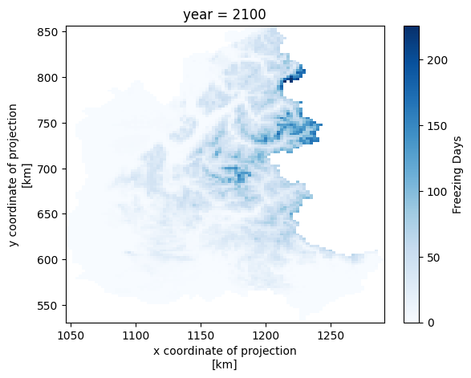
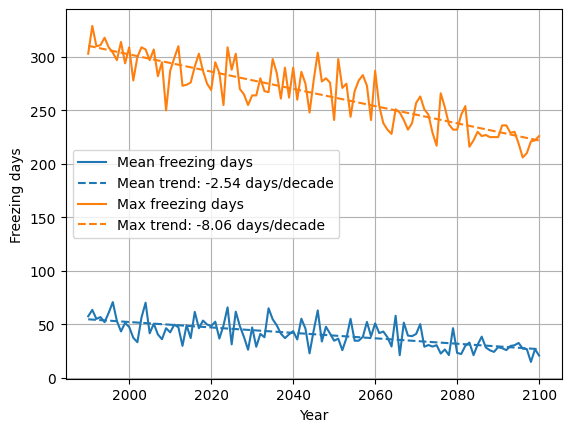
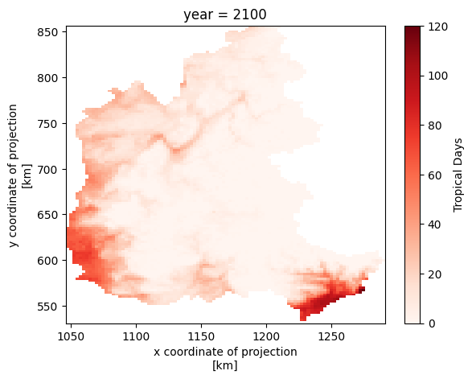
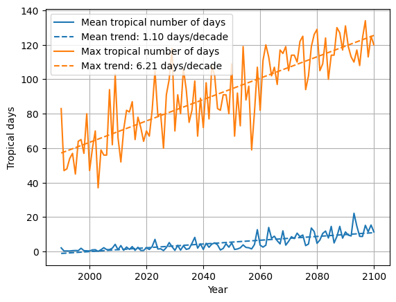

# Select only the data for the "Alpes" region
```
Alpes_selection.ipynb
```

# Count number of days under the 0degree Celsius
```
Isotherme.ipynb
```

# Count number of days above the 20degree Celsius
```
Tropical.ipynb
```


## Figures






